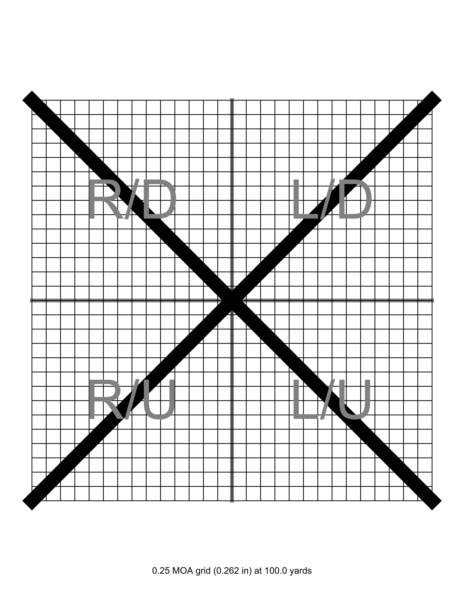

# Target Generator

Target generator I use to create paper target to assist with zeroing optics

## Example

## Docker Install

[https://hub.docker.com/r/treychaffin/targetgenerator](https://hub.docker.com/r/treychaffin/targetgenerator)

    docker container run -d -p 5000:5000 treychaffin/targetgenerator:latest
